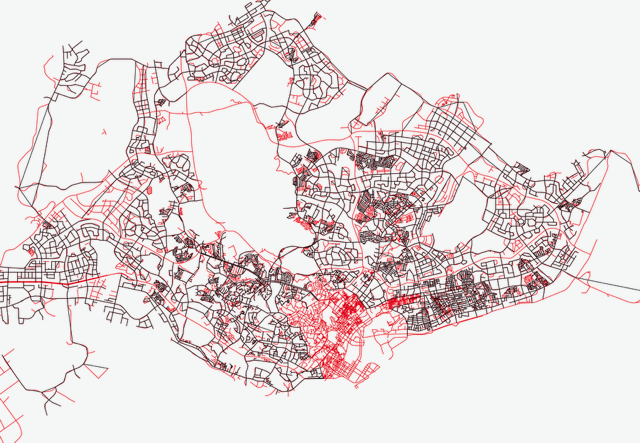
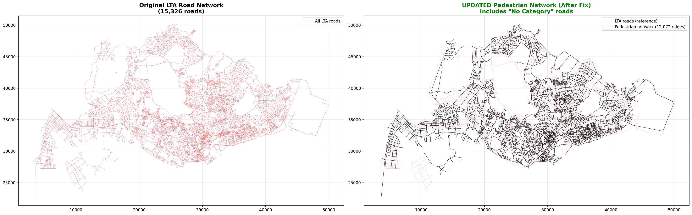
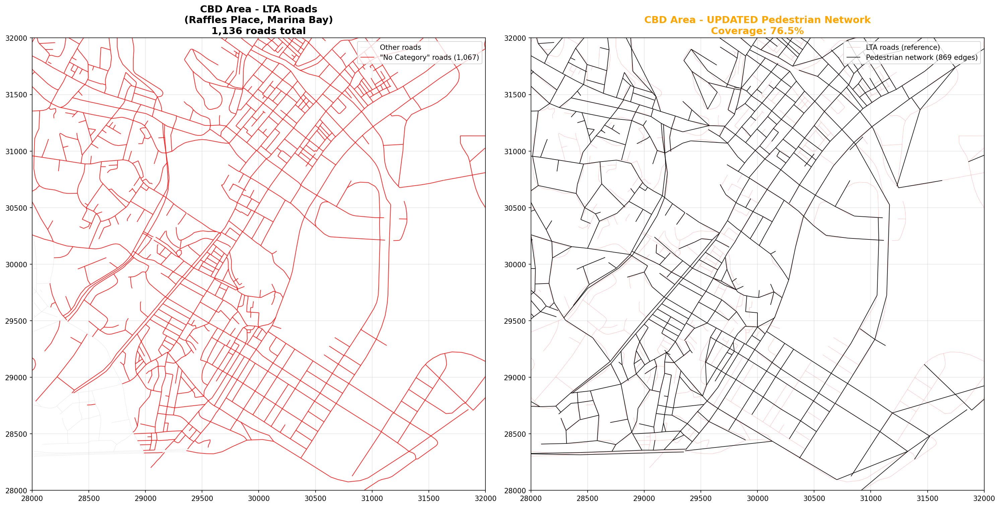

# Singapore Halal Outlet Pedestrian Network Analysis

<p align="center">
  
  <br/>
  <em>6,595 geocoded halal-certified outlets overlaid on the Singapore pedestrian network</em>
</p>

<p align="center">
  
  
  
  
  
  
</p>

---

## Abstract

This project builds a **city-scale pedestrian routing network** for Singapore and uses it to analyse the spatial accessibility of **6,595 MUIS-certified halal food outlets**. Data was collected from the MUIS Halal API and HalalTag, deduplicated, geocoded via Singapore's national building dataset, and snapped onto a hybrid road-footpath graph constructed from four LTA geospatial layers. The resulting network spans **2,107.9 km** across **10,641 nodes** and connects **5,430 outlets (82.3%)** within a 500 m walking threshold, enabling shortest-path routing, isochrone analysis, and accessibility scoring at island-wide scale.

---

## Table of Contents

- [Tech Stack](#tech-stack)
- [Dataset](#dataset)
- [Pipeline Overview](#pipeline-overview)
- [Network Construction](#network-construction)
- [Visualisations](#visualisations)
- [Network Statistics](#network-statistics)
- [Quick Start](#quick-start)
- [Project Structure](#project-structure)
- [Usage Examples](#usage-examples)
- [Limitations](#limitations)
- [Citation](#citation)

---

## Tech Stack

| Category | Tools |
|---|---|
| Language | Python 3.10+ |
| Graph / Routing | NetworkX, Dijkstra's algorithm |
| Geospatial | GeoPandas, Shapely, PyProj, Fiona |
| Data Processing | Pandas, NumPy |
| Web Scraping | Requests, tqdm |
| Visualisation | Matplotlib |
| Notebooks | Jupyter |
| GIS | QGIS / ArcGIS (Shapefiles, SVY21 CRS) |

---

## Dataset

### Halal Outlet Data

Two complementary sources were collected and merged:

| Source | Records | Method |
|---|---|---|
| [MUIS Halal API](https://halal.muis.gov.sg/) | ~1,200 | REST API pagination |
| [HalalTag](https://www.halaltag.com/) | ~5,700 | Web scraping |
| After deduplication | 6,897 | Fuzzy name + postal code matching |

Deduplication removed ~600 cross-source duplicates. Catering and central kitchen entries (Scheme 200) were excluded, leaving **6,897 eating establishments** for analysis.

### Geocoding

Outlets were geocoded against the **Building2025_PC** dataset (Singapore's national building-postal code register) in SVY21 projection:

| Method | Count | Rate |
|---|---|---|
| Postal code exact match | 6,539 | 94.8% |
| Address fuzzy match | 56 | 0.8% |
| Unmatched | 302 | 4.4% |
| **Total geocoded** | **6,595** | **95.6%** |

### LTA Geospatial Infrastructure (April 2025)

| Layer | Records | Role in Network |
|---|---|---|
| Road Section Lines | 15,326 segments | Network backbone |
| Footpaths | 109,973 segments | Dedicated pedestrian paths |
| Road Crossings | 9,634 points | Cross-road connections |
| Pedestrian Overhead Bridges / Underpasses | 768 polygons | Grade-separated links |

> Raw GIS files are excluded from this repository (gitignored). Download from [LTA DataMall](https://datamall.lta.gov.sg/).

---

## Pipeline Overview

```
 Step 1  DATA COLLECTION
         scrape_muis.py + scrape_halaltag.py
         Output: data/muis_complete_final.csv, data/halaltag_places.csv
            |
 Step 2  DEDUPLICATION & QUALITY
         deduplicate_outlets.py + fix_data_quality.py
         Output: data/deduplicated_outlets_corrected.csv
            |
 Step 3  GEOCODING
         scripts/geocode.ipynb  (postal code + fuzzy address matching)
         Output: data/deduplicated_outlets_geocoded.csv
            |
 Step 4  NETWORK CONSTRUCTION
         build_pedestrian_network.py  (hybrid road-footpath graph)
         Output: network/pedestrian_network_graph_v2.pkl
            |
 Step 5  ANALYSIS & VALIDATION
         validate_network_routing.py + network_usage_examples.py
         Output: network/routing_validation_tests.csv
                 network/outlet_accessibility_analysis.csv
```

---

## Network Construction

### Strategy: Hybrid Road-Footpath Approach

Rather than building purely from the fragmented LTA footpath dataset, the network uses the road network as a connectivity backbone and enriches it with dedicated footpath segments:

1. **Backbone**: Road categories 2-5 (excludes expressways). Pedestrian pathways are assumed to exist along these roads, consistent with Singapore's built environment.
2. **Enhancement**: 106,210 quality footpath segments added after filtering artifacts shorter than 2 m.
3. **Connections**: 9,618 crossings and 768 bridges/underpasses added as cross-road links.
4. **Node snapping**: Grid-based 5 m snapping merges 59,906 near-duplicate endpoints, reducing 257,096 raw endpoints to 197,190 unique nodes.

### Edge Weighting

All edges are weighted by **walking time (minutes)** using impedance factors that reflect comfort and delay:

| Infrastructure Type | Impedance | Rationale |
|---|---|---|
| Footpaths | 0.80x | Most preferred, dedicated pedestrian |
| Local roads (Cat 5) | 0.90x | Quiet residential streets |
| Primary access (Cat 4) | 1.00x | Baseline speed |
| Minor arterial (Cat 3) | 1.15x | Moderate traffic |
| Major arterial (Cat 2) | 1.30x | Heavy traffic |
| Road crossings | 1.20x + 30 s wait | Signal delay and exposure |
| Bridges / Underpasses | 1.30x + 60 s | Vertical movement penalty |

Base walking speed: **83.3 m/min (5 km/h)**

---

## Visualisations

### Full Island Network Coverage

<p align="center">
  
  <br/>
  <em>Halal outlets (red) on the pedestrian routing network (black), island-wide view</em>
</p>

### Network Before and After Construction Fix

<p align="center">
  
  <br/>
  <em>Left: Raw LTA road network (15,326 roads). Right: Final pedestrian network with uncategorised roads included (11,973 edges)</em>
</p>

### CBD Area Deep Dive (Raffles Place / Marina Bay)

<p align="center">
  
  <br/>
  <em>Left: LTA roads in the CBD (1,136 roads). Right: Updated pedestrian network with 78.9% outlet coverage in the CBD</em>
</p>

---

## Network Statistics

```
PEDESTRIAN NETWORK  (v2, December 2025)
-----------------------------------------
Nodes                    10,641
Edges                    11,808
Total length              2,107.9 km
Avg node degree               2.22
Max node degree              10
Fully connected           Yes (single component)

OUTLET COVERAGE
-----------------------------------------
Geocoded outlets          6,595
Connected outlets         5,430  (82.3%)
Avg connection distance     123.0 m
Max connection distance     500.0 m  (cutoff threshold)

EDGE TYPE DISTRIBUTION
-----------------------------------------
Roads                    83.7%
Outlet connections       13.0%
Footpaths                 3.1%
Crossings                 0.2%
```

---

## Quick Start

### 1. Install dependencies

```bash
git clone https://github.com/<your-username>/singapore-halal-network.git
cd singapore-halal-network
python -m venv venv && source venv/bin/activate
pip install -r requirements.txt
```

> **Note:** `network/pedestrian_network_graph_v2.pkl` (~50 MB) is excluded from git.
> Run `scripts/build_pedestrian_network.py` to regenerate it, or download it separately.

### 2. Load the network

```python
import pickle, networkx as nx, pandas as pd

with open("network/pedestrian_network_graph_v2.pkl", "rb") as f:
    G = pickle.load(f)

outlets = pd.read_csv("network/outlet_network_connections_v2.csv")

print(f"Nodes: {G.number_of_nodes():,}  |  Edges: {G.number_of_edges():,}")
print(f"Outlets connected: {len(outlets):,}")
```

### 3. Find the shortest walking route between two outlets

```python
outlet_a = outlets.iloc[0]
outlet_b = outlets.iloc[100]

node_a = (round(outlet_a["X"], 2), round(outlet_a["Y"], 2))
node_b = (round(outlet_b["X"], 2), round(outlet_b["Y"], 2))

path      = nx.shortest_path(G, node_a, node_b, weight="weight")
walk_time = nx.shortest_path_length(G, node_a, node_b, weight="weight")
distance  = sum(G[path[i]][path[i+1]]["length_m"] for i in range(len(path)-1))

print(f"Walking time : {walk_time:.1f} min")
print(f"Distance     : {distance/1000:.2f} km")
print(f"Route steps  : {len(path)-1} segments")
```

### 4. Run the worked examples

```bash
python scripts/network_usage_examples.py
```

---

## Project Structure

```
singapore-halal-network/
├── README.md
├── requirements.txt
├── .gitignore
├── data/
│   ├── muis_complete_final.csv
│   ├── muis_complete_final.json
│   ├── halaltag_places.csv
│   ├── halaltag_places.json
│   ├── halaltag_fixed.csv
│   ├── deduplicated_outlets_corrected.csv
│   └── deduplicated_outlets_geocoded.csv
├── scripts/
│   ├── scrape_muis.py
│   ├── scrape_halaltag.py
│   ├── deduplicate_outlets.py
│   ├── fix_data_quality.py
│   ├── geocode.ipynb
│   ├── build_pedestrian_network.py
│   ├── validate_network_routing.py
│   ├── network_usage_examples.py
│   ├── explore_network_data.py
│   └── visualize_network_coverage.py
├── network/
│   ├── pedestrian_network_graph_v2.pkl
│   ├── outlet_network_connections_v2.csv
│   ├── outlet_accessibility_analysis.csv
│   ├── routing_validation_tests.csv
│   ├── example_route.csv
│   ├── network_statistics.txt
│   ├── NETWORK_DOCUMENTATION.md
│   └── pedestrian_network_edges_v2.*
└── visualizations/
    ├── outlet_network_map.png
    ├── cbd_area_analysis.png
    └── network_before_after.png
```

| Folder | Contents |
|---|---|
| `data/` | Raw scraped outlet data from MUIS and HalalTag, deduplicated and geocoded outputs |
| `scripts/` | End-to-end pipeline: scraping, deduplication, geocoding, network construction, validation |
| `network/` | NetworkX graph, outlet-node mapping, GIS shapefiles, analysis outputs |
| `visualizations/` | Map exports: island-wide coverage, CBD deep dive, before/after comparison |

---

## Usage Examples

### Isochrone: outlets reachable within N minutes

```python
source_node = (round(outlets.iloc[0]["X"], 2), round(outlets.iloc[0]["Y"], 2))

for minutes in [5, 10, 15, 20]:
    reachable = nx.single_source_dijkstra_path_length(
        G, source_node, cutoff=minutes, weight="weight"
    )
    outlet_count = sum(
        1 for _, o in outlets.iterrows()
        if (round(o["X"], 2), round(o["Y"], 2)) in reachable
    )
    print(f"{minutes:>2} min walk: {outlet_count} outlets reachable")
```

### Accessibility score per outlet (15-minute walk)

```python
scores = []
for _, outlet in outlets.iterrows():
    node = (round(outlet["X"], 2), round(outlet["Y"], 2))
    if node not in G:
        continue
    reachable = nx.single_source_dijkstra_path_length(G, node, cutoff=15, weight="weight")
    count = sum(1 for _, o in outlets.iterrows()
                if (round(o["X"], 2), round(o["Y"], 2)) in reachable)
    scores.append({"name": outlet["name"], "outlets_15min": count})

pd.DataFrame(scores).sort_values("outlets_15min", ascending=False).head(10)
```

### Strategic hub identification via betweenness centrality

```python
bc = nx.betweenness_centrality(G, weight="weight", normalized=True)
top_nodes = sorted(bc, key=bc.get, reverse=True)[:20]
```

### Load in QGIS or ArcGIS

Open `network/pedestrian_network_edges_v2.shp` directly. Coordinate system is **SVY21** (Singapore national CRS, EPSG-like, units in metres).

---

## Limitations

| Limitation | Detail |
|---|---|
| 17.7% outlet gap | 1,165 outlets not connected: remote locations more than 500 m from the network or geocoding failures |
| Constant walking speed | Fixed at 5 km/h with no slope, weather, or crowding adjustments |
| No indoor connections | Shopping mall corridors and MRT concourses are not modelled |
| Simplified bridges | Polygon footprints converted to centrelines; exact stair geometry omitted |
| Data currency | Network: April 2025. Outlet data: December 2025 snapshot |
| Crossing penalties | 30-second wait is an average estimate; actual signal timing varies |

For accessibility studies, use results for **relative comparisons** rather than exact walking times.

---

## Citation

```
Singapore Halal Outlet Pedestrian Accessibility Network
Data: MUIS Halal API, HalalTag, LTA DataMall (April 2025)
Method: Hybrid road-footpath graph with 5 m grid-snapped nodes
Coverage: 5,430 halal outlets (82.3%), 10,641 nodes, 2,107.9 km
Date: December 2025
```

---

## Acknowledgements

- **MUIS** (Majlis Ugama Islam Singapura): Halal certification data via public API
- **HalalTag**: Community-sourced halal outlet listings
- **Land Transport Authority (LTA)**: Road, footpath, crossing, and bridge geospatial data via LTA DataMall
- **Singapore Land Authority (SLA)**: Building2025_PC postal code dataset

---

<p align="center">
  <sub>Built with Python · Geospatial Analysis · Singapore · 2025</sub>
</p>
